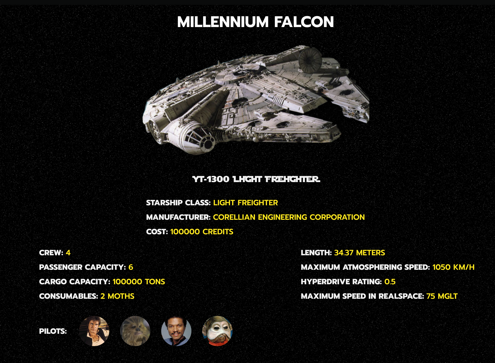

# Sprint 8. React III 

### ****[Live Site]( https://react-sprint8.netlify.app/)****

### **🎯 Objetivos generales**

- Aprender a consumir datos de una API en React. 
- Entender qué son los test unitarios y aprender cómo implementarlos en React.

### **🎯 Objetivos específicos**

- Repasar los componentes, state, useEffect y cerca de React.
- Repasar styled-components.
- Utilizar localStorage.
- Utilizar rutas de React.
- Consumo de datos de una API.

### **📌 Descripción**

¡La web que debes desarrollar es una web de información sobre las naves de Star Wars! Deberá mostrarse el listado de naves con la información detallada de cada una de ellas.

## ****Nivel I ⭐️****

#### Ejercicio 1

Para empezar, lo primero que debes implementar es la pantalla principal en la que se muestra el listado de naves.

Cuando obtengas el listado de naves del servidor, verás que éste te devuelve muchos datos interesantes de cada nave, pero en la pantalla principal sólo mostraremos los datos más importantes para no saturarle de información.

Datos a mostrar de cada nave del listado:

- Nombre de nave.
- Modelo.

 - [ ] 📪 Entregado

#### Ejercicio 2

En este ejercicio debes crear la ficha de cada nave, mostrando todos sus detalles.

El usuario/a podrá acceder a los detalles de cada nave clicando en cada una de las naves del listado:

- **Número de páginas * el número de idiomas * 30 €**
  

- [ ] 📪 Entregado

#### **Ejercicio 3**

Tienes que implementar un botón al final del listado de naves, con el texto "view more", que permita obtener más naves del servidor y se agreguen al listado de naves mostradas al usuario.

**Bonus:** es preferible implementar un scroll infinito, que cargue más naves a medida que el usuario haga scroll en la web.

**Ayuda:** tendrás que hacer uso de la paginación, recurre a la descripción del proyecto si tienes dudas, ya que existe una breve descripción de la paginación y la URL a implementar.

 - [ ] 📪 Entregado

####  **Ejercicio 4**

Modernización del sitio. Cambia los estilos que creas pertinentes. El único criterio es que se parezca lo máximo posible en la web oficial de Star Wars.

 - [ ] 📪 Entregado

#### **Ejercicio 5**

Al igual que hemos hecho en las entregas anteriores, implementaremos una página inicial de bienvenida, y mediante un botón, se podrá acceder a la página principal de naves. Para ello, debes usar el routing de React.

Además del botón de acceso en la página principal, el usuario tendrá acceso a la página principal mediante la barra de navegación superior.

Para ello, si todavía no has implementado el componente, deberás crear la barra de navegación superior.

 - [ ] 📪 Entregado

#### **Ejercicio 6**

Tienes que implementar una pantalla de login y registro, en las que mediante localstorage, puesto que no poseemos un servidor de autenticación de usuarios/as, se puedan registrar y alquilar posteriormente en caso de que existan.

En este ejercicio con el que muestres el resultado del login/registro por consola es suficiente.

- [ ] 📪 Entregado

***

## ****Nivel II ⭐️⭐️****

#### **Ejercicio 7**

Modificaremos ligeramente la navegación, para que cuando no se detecte el usuario registrado/a, se le lleve al "login".

El listado de naves sólo puede ser visible para usuarios/as registrados/as, debes proteger las rutas.

ℹ️ **Com protegir rutes**

**[How to create guarded routes for your React-App](https://blog.netcetera.com/how-to-create-guarded-routes-for-your-react-app-d2fe7c7b6122).**

- [ ] 📪 Entregado

#### **Ejercicio 8**

En este ejercicio enriqueceremos la ficha de cada nave mostrando las tarjetas de sus pilotos.

**RECUERDA** que con React funcionamos con componentes, tendrás que crear un nuevo componente para mostrar estas tarjetas dentro del detalle de nave.

No olvides maquetar esta nueva parte.

 - [ ] 📪 Entregado

#### **Ejercicio 8**

En este ejercicio deberás implementar 3 botones en la parte superior del listado, que efectúan las siguientes tareas:

- Botón ordenar alfabéticamente los presupuestos.
- Botón ordenar por fecha los presupuestos.
- Botón reinicializar el orden.
  
 - [ ]  📪 Entregado
  

#### **Ejercicio 9**

Al igual que has hecho anteriormente, tendrás que mostrar las tarjetas de las películas en las que ha aparecido la nave.

No olvides maquetar esta nueva parte.

 - [ ]  📪 Entregado

## ****Nivel III ⭐️⭐️⭐️****

**Ejercicio 10**

Dado que esta aplicación puede crecer más, para preparar una buena base garantizando que no aparecen bugs en un futuro, tendrás que implementar tests unitarios.

ℹ️ Crear test unitario para al menos tres componentes.

 - [ ]  📪 Entregado